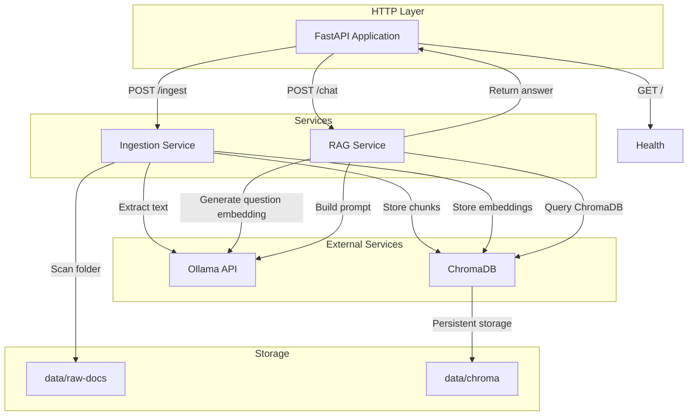
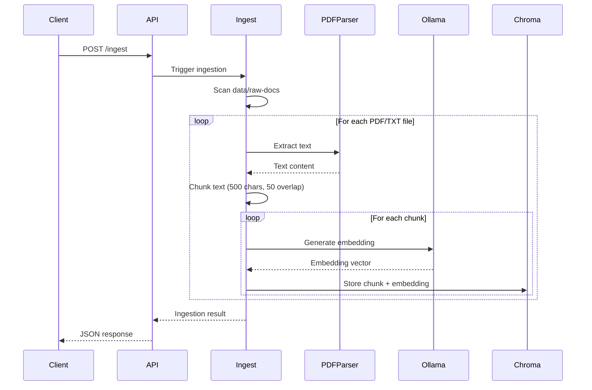
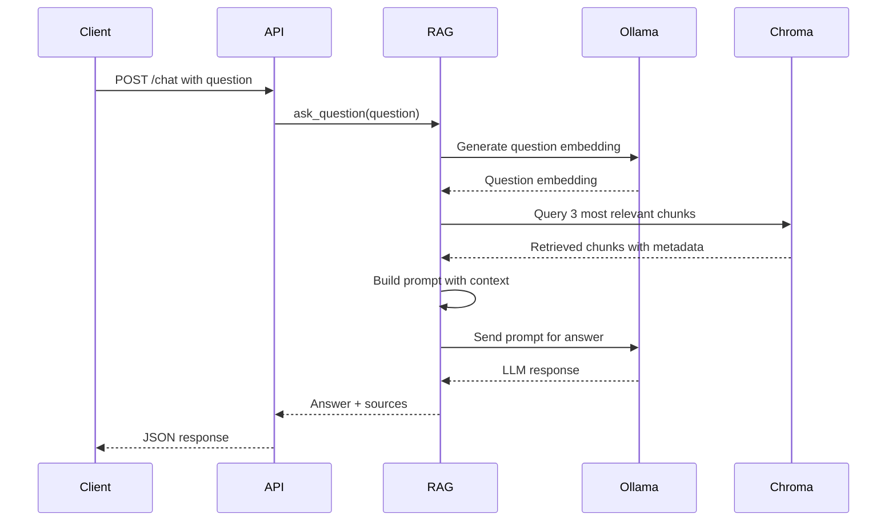

# Local RAG Backend - Technical Design Document

## Overview

This document describes the technical design for a Local RAG (Retrieval-Augmented Generation) Backend system. The system is a FastAPI-based RAG orchestrator that ingests documents from a local folder, creates embeddings using Ollama, stores vectors in ChromaDB, and provides HTTP API endpoints for chat and ingestion.

### Key Components

- **FastAPI Application**: HTTP API server handling health checks, document ingestion, and question-answering
- **Document Ingestion Service**: Scans local folder, extracts text from PDFs, chunks text, creates embeddings, stores in ChromaDB
- **Ollama Client**: Interface to Ollama for generating embeddings (nomic-embed-text) and LLM responses (qwen3:8b)
- **ChromaDB Client**: Interface to ChromaDB for storing and querying embeddings
- **RAG Service**: Orchestrates retrieval and prompt building for question answering

### Architecture Diagram



## Architecture

### Component Interaction Flow

#### Document Ingestion Flow



#### Question Answering Flow



### Data Flow

1. **Ingestion Path**:
   - Client triggers ingestion via `/ingest` endpoint
   - System scans `data/raw-docs` folder for PDF and text files
   - For each file: extract text → chunk text → generate embeddings → store in ChromaDB
   - Return summary of processed files and any errors

2. **Chat Path**:
   - Client submits question via `/chat` endpoint
   - System generates question embedding
   - Query ChromaDB for 3 most relevant chunks
   - Build prompt with chunks as context
   - Send prompt to Ollama LLM
   - Return answer with source citations

## Components and Interfaces

### API Endpoints

#### Health Check

```
GET /
```

**Response (200 OK)**:
```json
{
  "message": "RAG API running"
}
```

#### Document Ingestion

```
POST /ingest
```

**Request**: No body required

**Response (200 OK)**:
```json
{
  "files_processed": 5,
  "chunks_created": 42,
  "errors": [
    {
      "file": "corrupted.pdf",
      "error": "Failed to parse PDF: Invalid format"
    }
  ]
}
```

**Response (500 Internal Server Error)**:
```json
{
  "error": "Failed to connect to ChromaDB"
}
```

#### Question Answering

```
POST /chat
```

**Request Body**:
```json
{
  "question": "What is the leave policy?"
}
```

**Response (200 OK)**:
```json
{
  "answer": "Employees receive 20 annual leave days...",
  "sources": [
    {
      "text": "Employees are entitled to 20 annual leave days per year...",
      "source": "employee-handbook.pdf"
    },
    {
      "text": "Annual leave accrues at 1.67 days per month...",
      "source": "employee-handbook.pdf"
    }
  ]
}
```

**Response (400 Bad Request)**:
```json
{
  "error": "Question is required"
}
```

**Response (503 Service Unavailable)**:
```json
{
  "error": "Ollama service unavailable"
}
```

### Data Models

#### Chunk Model

```python
class Chunk(BaseModel):
    id: str  # UUID
    text: str  # Text content (500 chars with 50 overlap)
    embedding: List[float]  # 768-dimensional vector from nomic-embed-text
    metadata: Dict[str, str]  # {"source": "filename.pdf"}
```

#### Chat Request/Response Models

```python
class ChatRequest(BaseModel):
    question: str

class Source(BaseModel):
    text: str
    source: str

class ChatResponse(BaseModel):
    answer: str
    sources: List[Source]

class IngestionResult(BaseModel):
    files_processed: int
    chunks_created: int
    errors: List[Dict[str, str]]
```

### File Structure

```
apps/api/
├── app/
│   ├── __init__.py
│   ├── main.py              # FastAPI app and endpoint definitions
│   ├── config.py            # Configuration (Ollama URL, ChromaDB path)
│   ├── models.py            # Pydantic models for request/response
│   ├── ollama_client.py     # Ollama API client
│   ├── chroma_client.py     # ChromaDB client and collection management
│   ├── rag_service.py       # RAG orchestration (ingestion, chat)
│   └── exceptions.py        # Custom exceptions
├── requirements.txt
└── start.sh / start.bat     # Startup script
```

### Integration Points

#### Ollama Integration

**Embedding Generation**:
```python
POST http://localhost:11434/api/embeddings
{
  "model": "nomic-embed-text",
  "prompt": "text to embed"
}
```

**LLM Response**:
```python
POST http://localhost:11434/api/generate
{
  "model": "qwen3:8b",
  "prompt": "prompt with context",
  "stream": false
}
```

#### ChromaDB Integration

**Persistent Storage**:
```python
client = chromadb.PersistentClient(path="data/chroma")
collection = client.get_or_create_collection(name="documents")
```

**Storage Operations**:
```python
collection.add(
    ids=[str(uuid4())],
    embeddings=[embedding_vector],
    documents=[chunk_text],
    metadatas=[{"source": "filename.pdf"}]
)

results = collection.query(
    query_embeddings=[question_embedding],
    n_results=3
)
```

## Data Models

### Database Schema (ChromaDB Collection)

| Field | Type | Description |
|-------|------|-------------|
| id | string | UUID for each chunk |
| embedding | float array | 768-dimensional vector |
| document | string | Text content (500 chars) |
| metadata | object | {"source": "filename.pdf"} |

### In-Memory Data Structures

#### Chunk
- `id`: UUID string
- `text`: String (500 characters with 50-character overlap)
- `embedding`: List of 768 floats
- `metadata`: Dictionary with source filename

#### Question Answering Context
- `question`: User's natural language query
- `retrieved_chunks`: List of 3 most relevant chunks
- `prompt`: Constructed prompt with context
- `answer`: LLM-generated response
- `sources`: List of source citations

## Correctness Properties

*A property is a characteristic or behavior that should hold true across all valid executions of a system-essentially, a formal statement about what the system should do. Properties serve as the bridge between human-readable specifications and machine-verifiable correctness guarantees.*

### Property 1: Chunking preserves text integrity

*For any* text document, chunking it into 500-character segments with 50-character overlap shall preserve all original text without modification or loss.

**Validates: Requirements 2.4**

### Property 2: Embedding generation is deterministic

*For any* given text string, generating an embedding using Ollama's nomic-embed-text model shall produce the same embedding vector across multiple calls with the same input.

**Validates: Requirements 2.5**

### Property 3: ChromaDB storage preserves metadata

*For any* chunk stored in ChromaDB, retrieving it shall return the exact same text and metadata (including source filename) that was stored.

**Validates: Requirements 2.6, 4.3**

### Property 4: Retrieval returns relevant chunks

*For any* question and set of stored document chunks, querying ChromaDB for the 3 most relevant chunks shall return chunks that are semantically related to the question.

**Validates: Requirements 3.3**

### Property 5: Prompt construction includes all retrieved chunks

*For any* set of retrieved chunks and question, building a prompt shall include all chunks as context in the prompt sent to the LLM.

**Validates: Requirements 3.4**

### Property 6: Source citations preserve original text

*For any* source citation in the /chat response, the "text" field shall contain the exact chunk text retrieved from ChromaDB without modification.

**Validates: Requirements 3.7, 4.1**

### Property 7: Source citations include source filename

*For any* source citation in the /chat response, the "source" field shall contain the filename from ChromaDB metadata.

**Validates: Requirements 3.8, 4.2**

### Property 8: Ingestion continues on file errors

*For any* set of files being ingested, if one file fails to parse, the system shall log the error and continue processing remaining files.

**Validates: Requirements 2.7, 6.1**

### Property 9: Error responses include descriptive messages

*For any* error condition, the response shall include an "error" or "message" field describing the issue.

**Validates: Requirements 9.1**

### Property 10: Persistence survives restarts

*For any* set of documents ingested and stored in ChromaDB, restarting the system shall preserve all previously ingested documents.

**Validates: Requirements 7.2**

### Property 11: Incremental ingestion processes only new files

*For any* set of documents in the raw-docs folder, running ingestion shall only process files that haven't been previously ingested.

**Validates: Requirements 7.3**

## Error Handling

### Error Categories

1. **Input Validation Errors (400 Bad Request)**
   - Empty or missing question in /chat request
   - Invalid JSON in request body

2. **External Service Unavailable (503 Service Unavailable)**
   - Ollama not reachable
   - ChromaDB not reachable

3. **Processing Errors (Logged, continue operation)**
   - PDF parsing failures
   - Text extraction failures
   - Embedding generation failures

4. **System Errors (500 Internal Server Error)**
   - Unexpected exceptions
   - Configuration errors

### Error Response Format

All error responses follow a consistent format:

```json
{
  "error": "Descriptive error message"
}
```

### Implementation Examples

#### FastAPI Exception Handlers

```python
from fastapi import FastAPI, Request, HTTPException
from fastapi.responses import JSONResponse
from fastapi.exceptions import RequestValidationError

app = FastAPI()

@app.exception_handler(RequestValidationError)
async def validation_exception_handler(request: Request, exc: RequestValidationError):
    return JSONResponse(
        status_code=400,
        content={"error": "Invalid request: " + str(exc.errors())}
    )

@app.exception_handler(ServiceUnavailable)
async def service_unavailable_handler(request: Request, exc: ServiceUnavailable):
    return JSONResponse(
        status_code=503,
        content={"error": str(exc)}
    )

@app.exception_handler(Exception)
async def general_exception_handler(request: Request, exc: Exception):
    logger.error(f"Unexpected error: {exc}")
    return JSONResponse(
        status_code=500,
        content={"error": "Internal server error"}
    )
```

#### Ingestion Error Handling

```python
# In ingestion service
try:
    text = extract_text_from_pdf(filepath)
except PDFParseError as e:
    logger.error(f"Failed to parse {filepath}: {e}")
    errors.append({"file": filepath, "error": str(e)})
    continue  # Continue with other files
```

#### External Service Error Handling

```python
# Ollama client
try:
    response = requests.post(ollama_url, json=payload, timeout=30)
    response.raise_for_status()
except requests.exceptions.ConnectionError:
    raise ServiceUnavailable("Ollama service unavailable")
except requests.exceptions.Timeout:
    raise ServiceUnavailable("Ollama request timeout")
```

#### ChromaDB Error Handling

```python
# ChromaDB client
try:
    collection.add(ids, embeddings, documents, metadatas)
except Exception as e:
    logger.error(f"Failed to store in ChromaDB: {e}")
    raise ServiceUnavailable("ChromaDB service unavailable")
```

## Error Handling Strategy

### Error Categories

1. **Input Validation Errors (400 Bad Request)**
   - Empty or missing question in /chat request
   - Invalid JSON in request body

2. **External Service Unavailable (503 Service Unavailable)**
   - Ollama not reachable
   - ChromaDB not reachable

3. **Processing Errors (Logged, continue operation)**
   - PDF parsing failures
   - Text extraction failures
   - Embedding generation failures

4. **System Errors (500 Internal Server Error)**
   - Unexpected exceptions
   - Configuration errors

### Error Response Format

```json
{
  "error": "Descriptive error message"
}
```

### Error Handling Implementation

```python
# Ingestion error handling
try:
    text = extract_text_from_pdf(filepath)
except PDFParseError as e:
    logger.error(f"Failed to parse {filepath}: {e}")
    errors.append({"file": filepath, "error": str(e)})
    continue  # Continue with other files

# External service error handling
try:
    response = requests.post(ollama_url, json=payload, timeout=30)
except requests.exceptions.ConnectionError:
    raise ServiceUnavailable("Ollama service unavailable")
```

## Testing Strategy

### Dual Testing Approach

This system uses a combination of unit tests and property-based tests:

- **Unit tests**: Verify specific examples, edge cases, and error conditions
- **Property tests**: Verify universal properties across all inputs (when applicable)

### Property-Based Testing

The following properties are suitable for property-based testing:

1. **Chunking preserves text integrity** - Test with various text lengths and verify all content is preserved
2. **Embedding generation is deterministic** - Test with same text multiple times
3. **ChromaDB storage preserves metadata** - Store and retrieve chunks with various metadata
4. **Prompt construction includes all chunks** - Test with various chunk sets
5. **Source citations preserve original text** - Verify text field matches stored chunks
6. **Source citations include source filename** - Verify source field contains filename
7. **Ingestion continues on file errors** - Test with mix of valid and invalid files
8. **Persistence survives restarts** - Ingest, restart, verify data remains
9. **Incremental ingestion processes only new files** - Test with existing and new files

### Unit Testing

Unit tests should cover:

1. **Input validation**:
   - Empty question returns 400
   - Missing question field returns 400
   - Invalid JSON returns 400

2. **Edge cases**:
   - Empty document folder
   - Single character text
   - Very long documents (1000+ pages)
   - Special characters in filenames

3. **Integration points**:
   - Ollama API call with mocked response
   - ChromaDB storage and retrieval
   - PDF text extraction with various PDFs

### Test Configuration

- Property-based tests: Minimum 100 iterations per property
- Tag format: **Feature: local-rag-backend, Property {number}: {property_text}**
- Integration tests: 1-3 representative examples for external service behavior

### Testing Tools

- **pytest**: Testing framework
- **hypothesis** or **fast-check**: Property-based testing library
- **pytest-asyncio**: Async testing support
- **pytest-mock**: Mocking external services

## Deployment Considerations

### Local Setup Requirements

1. **Ollama Installation**
   - Download from https://ollama.com/download
   - Pull required models:
     ```bash
     ollama pull nomic-embed-text
     ollama pull qwen3:8b
     ```

2. **ChromaDB Configuration**
   - Use persistent storage at `data/chroma`
   - Ensure sufficient disk space for embeddings

3. **Python Dependencies**
   - fastapi
   - uvicorn
   - chromadb
   - pypdf
   - requests

### Folder Structure

```
local-rag/
├── apps/api/
│   ├── app/
│   │   ├── main.py
│   │   ├── config.py
│   │   ├── models.py
│   │   ├── ollama_client.py
│   │   ├── chroma_client.py
│   │   ├── rag_service.py
│   │   └── exceptions.py
│   └── requirements.txt
├── data/
│   ├── raw-docs/      # Place PDFs and text files here
│   └── chroma/        # ChromaDB persistent storage
└── start.sh / start.bat
```

### Startup Script

```bash
#!/bin/bash
# start.sh

# Create required directories
mkdir -p data/raw-docs
mkdir -p data/chroma

# Activate virtual environment
source venv/bin/activate

# Start FastAPI server
uvicorn app.main:app --reload --host 0.0.0.0 --port 8000
```

### Performance Considerations

1. **Embedding Generation**: Can be slow for large documents; consider batching
2. **ChromaDB Queries**: Performance depends on collection size; consider indexing
3. **LLM Response Time**: Depends on hardware; qwen3:8b requires sufficient RAM
4. **Concurrent Requests**: Use async/await for I/O-bound operations

### Monitoring and Maintenance

1. **Health Check**: Monitor `/` endpoint for service availability
2. **Ingestion Logs**: Track ingestion success/failure rates
3. **ChromaDB Size**: Monitor disk usage for vector storage
4. **Ollama Health**: Ensure Ollama service is running

### Troubleshooting

1. **Ollama Unavailable**: Check Ollama service is running on port 11434
2. **ChromaDB Issues**: Verify data/chroma directory is writable
3. **PDF Parsing Errors**: Check PDF files are not corrupted
4. **Slow Responses**: Consider smaller documents or hardware acceleration