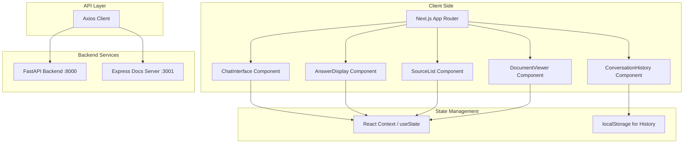

# Local RAG Frontend - Technical Design Document

## Overview

The Local RAG Frontend is a Next.js-based web application that serves as the user interface for a local Retrieval-Augmented Generation (RAG) system. The application provides a chat interface for users to ask questions about their documents and receive answers generated by a FastAPI backend, with source citations showing which document chunks were used to generate each answer.

### Key Components

- **Next.js App Router**: Modern React framework with server-side rendering and routing
- **TypeScript**: Type-safe development for all code
- **Tailwind CSS**: Utility-first CSS framework for responsive styling
- **Axios**: HTTP client for API communication

### Architecture



## Architecture

### Next.js App Router Structure

```
app/
├── layout.tsx              # Root layout with metadata
├── page.tsx                # Main chat interface page
├── components/
│   ├── ChatInterface.tsx   # Main chat input and submission
│   ├── AnswerDisplay.tsx   # Answer rendering with citations
│   ├── SourceList.tsx      # List of source citations
│   ├── DocumentViewer.tsx  # Document viewing modal/link
│   └── ConversationHistory.tsx
├── hooks/
│   ├── useChat.ts          # Chat state and API integration
│   └── useDocument.ts      # Document fetching logic
├── types/
│   ├── chat.ts             # Chat-related types
│   └── document.ts         # Document-related types
└── utils/
    └── api.ts              # API configuration and helpers
```

### Component Hierarchy

```
ChatInterface (main container)
├── ConversationHistory (displays past interactions)
├── InputArea
│   ├── TextArea (question input)
│   └── SubmitButton
├── LoadingIndicator (shown during API calls)
├── AnswerDisplay (displays answer and sources)
│   ├── AnswerText
│   └── SourceList
│       └── SourceItem (for each source)
│           ├── DocumentLink
│           └── Snippet
└── ErrorBoundary (handles errors gracefully)
```

## Components and Interfaces

### Core Components

#### ChatInterface

Main container component that orchestrates the chat experience.

**Props:**
- None (uses context/hooks for state)

**State:**
- `question`: Current input text
- `answer`: Current answer text
- `sources`: Array of source objects
- `isLoading`: Loading state
- `error`: Error message (if any)
- `conversationHistory`: Array of past interactions

**Methods:**
- `handleQuestionSubmit()`: Submit question to API
- `handleClearHistory()`: Clear conversation history
- `handleViewDocument()`: Open document in new tab

#### AnswerDisplay

Component responsible for displaying the answer and source citations.

**Props:**
- `answer`: string - The generated answer
- `sources`: Source[] - Array of source citations
- `isLoading`: boolean - Loading state

**State:**
- None (pure display component)

#### SourceList

Component that renders the list of source citations.

**Props:**
- `sources`: Source[] - Array of source citations

**State:**
- None (pure display component)

**Source Type:**
```typescript
interface Source {
  id: string;
  filename: string;
  snippet: string;
  documentUrl: string;
}
```

#### DocumentViewer

Component that handles document viewing.

**Props:**
- `filename`: string - Name of the document to view
- `baseUrl`: string - Base URL of the docs server

**State:**
- `isLoading`: boolean - Loading state for document fetch
- `error`: string - Error message (if any)

**Methods:**
- `handleViewDocument()`: Open document in new tab
- `handleFetchMetadata()`: Fetch document metadata

#### ConversationHistory

Component that displays past question-answer pairs.

**Props:**
- `history`: ConversationItem[] - Array of past interactions
- `maxItems`: number - Maximum number of items to display

**State:**
- None (pure display component)

**ConversationItem Type:**
```typescript
interface ConversationItem {
  question: string;
  answer: string;
  sources: Source[];
  timestamp: Date;
}
```

### API Integration

#### FastAPI Backend

**Base URL:** `http://localhost:8000`

**Endpoints:**

1. **POST /chat**
   - **Request:**
     ```typescript
     interface ChatRequest {
       question: string;
     }
     ```
   - **Response:**
     ```typescript
     interface ChatResponse {
       answer: string;
       sources: Source[];
     }
     ```
   - **Error Handling:**
     - 400: Bad request
     - 500: Internal server error
     - Network errors: Connection failure

2. **GET /**
   - **Response:**
     ```json
     { "message": "RAG API running" }
     ```

#### Express Docs Server

**Base URL:** `http://localhost:3001`

**Endpoints:**

1. **GET /docs/{filename}**
   - Serves the requested document
   - Returns 404 if document not found

### State Management

#### Local State (React Hooks)

- **useState**: For component-level state (input, loading, error)
- **useEffect**: For side effects (API calls, persistence)
- **useRef**: For DOM references (scrolling, focus)

#### Persistent State (localStorage)

- **Conversation History**: Last 10 question-answer pairs
- **Last Question**: Pre-fill input on page load

#### Context (if needed)

- **ChatContext**: For sharing state across components (if component tree grows)

## Data Models

### Chat Types

```typescript
interface ChatRequest {
  question: string;
}

interface ChatResponse {
  answer: string;
  sources: Source[];
}

interface Source {
  id: string;
  filename: string;
  snippet: string;
  documentUrl: string;
}

interface ConversationItem {
  question: string;
  answer: string;
  sources: Source[];
  timestamp: Date;
}
```

### Document Types

```typescript
interface DocumentMetadata {
  filename: string;
  size: number;
  type: string;
  lastModified: Date;
}

interface DocumentChunk {
  id: string;
  text: string;
  metadata: {
    source: string;
    chunkIndex: number;
  };
}
```

## Correctness Properties

*A property is a characteristic or behavior that should hold true across all valid executions of a system-essentially, a formal statement about what the system should do. Properties serve as the bridge between human-readable specifications and machine-verifiable correctness guarantees.*

### Property 1: Question submission sends correct API request

*For any* valid question string, when the user submits the question, the system SHALL send a POST request to `http://localhost:8000/chat` with a JSON body containing the question in the `question` field.

**Validates: Requirements 1.2**

### Property 2: Loading indicator appears during API calls

*For any* question submission, the system SHALL display a loading indicator within 500ms of the request being sent and hide it when the response is received or an error occurs.

**Validates: Requirements 1.3, 8.2**

### Property 3: Error messages include actionable guidance

*For any* error condition (network failure, API error, timeout), the system SHALL display an error message that includes actionable guidance for the user to resolve the issue.

**Validates: Requirements 1.4, 5.1, 5.2, 5.3, 5.4**

### Property 4: Answer display shows all sources

*For any* answer with sources, the system SHALL display all source citations below the answer in a numbered list with clear visual separation.

**Validates: Requirements 2.1, 2.3**

### Property 5: Source citations include required information

*For any* source citation, the system SHALL display the document filename and a snippet of the relevant text.

**Validates: Requirements 2.2**

### Property 6: Empty sources handled gracefully

*For any* answer with no sources, the system SHALL display a message indicating that no sources were found instead of an empty list.

**Validates: Requirements 2.4**

### Property 7: Document links point to correct server

*For any* source citation, the system SHALL provide a link that points to `http://localhost:3001/docs/{filename}` where `{filename}` is the source's filename.

**Validates: Requirements 3.1, 3.3**

### Property 8: Document links open in new tab

*For any* document link, when clicked, the system SHALL open the document in a new browser tab or window.

**Validates: Requirements 3.2**

### Property 9: Responsive layout adapts to viewport sizes

*For any* viewport width (320px, 768px, 1200px), the system SHALL adapt its layout to provide an appropriate user experience for that screen size.

**Validates: Requirements 4.1, 4.2, 4.3**

### Property 10: Interactive elements meet accessibility requirements

*For any* interactive element, the system SHALL ensure it is navigable using keyboard navigation (Tab, Enter, Escape) and has appropriate ARIA attributes for screen readers.

**Validates: Requirements 4.4, 9.1, 9.2, 9.3, 9.4**

### Property 11: Conversation history persists during session

*For any* conversation item, the system SHALL maintain it in the conversation history during the current browser session and display it above the current input field.

**Validates: Requirements 7.1, 7.2, 7.3, 7.4**

### Property 12: Empty document collection handled gracefully

*For any* page load, if the ChromaDB collection is empty, the system SHALL display a message indicating that documents need to be ingested with instructions for adding documents.

**Validates: Requirements 6.1, 6.2, 6.3**

### Property 13: Performance meets response time requirements

*For any* page load or question submission, the system SHALL complete the operation within the specified time limits (2 seconds for page load, 30 seconds for question submission).

**Validates: Requirements 8.1, 8.3, 8.4**

## Error Handling

### Network Errors

- **Connection Failure**: Display error message with actionable guidance
- **Timeout (30 seconds)**: Display timeout error message
- **Docs Server Unavailable**: Display warning that document viewing is unavailable

### API Errors

- **400 Bad Request**: Display error message from backend
- **500 Internal Server Error**: Display generic error message with guidance to check backend logs
- **Other HTTP Errors**: Display appropriate error message based on status code

### Error Message Format

All error messages shall include:
1. Clear description of the error
2. Actionable guidance for the user
3. Technical details (for debugging)

Example:
```
Error: Failed to connect to the RAG API.
Action: Check that the backend is running on port 8000.
```

### Error Boundary

Implement React Error Boundaries to catch and display errors in component rendering.

## Testing Strategy

### Dual Testing Approach

This project uses a dual testing approach combining unit tests and property-based tests for comprehensive coverage.

### Unit Testing

Unit tests verify specific examples, edge cases, and error conditions. They should focus on:

- **Specific examples** that demonstrate correct behavior
- **Integration points** between components
- **Edge cases** and error conditions
- **UI rendering** and interaction behavior

### Property-Based Testing

Property-based tests verify universal properties across all inputs. For this project, we'll use **fast-check** (a popular property-based testing library for JavaScript/TypeScript).

#### Property Test Configuration

- **Minimum iterations**: 100 per property test
- **Test tags**: **Feature: local-rag-frontend, Property {number}: {property_text}**
- **Timeout**: 30 seconds per property test

#### Property Tests to Implement

1. **Question submission sends correct API request**
   - Generate random question strings
   - Verify POST request to `/chat` with correct body
   - **Tag**: `Feature: local-rag-frontend, Property 1`

2. **Loading indicator appears during API calls**
   - Simulate slow API responses
   - Verify loading indicator appears within 500ms
   - **Tag**: `Feature: local-rag-frontend, Property 2`

3. **Error messages include actionable guidance**
   - Generate various error scenarios
   - Verify all error messages include actionable guidance
   - **Tag**: `Feature: local-rag-frontend, Property 3`

4. **Answer display shows all sources**
   - Generate answers with varying numbers of sources
   - Verify all sources are displayed in numbered list
   - **Tag**: `Feature: local-rag-frontend, Property 4`

5. **Source citations include required information**
   - Generate random source data
   - Verify filename and snippet are displayed
   - **Tag**: `Feature: local-rag-frontend, Property 5`

6. **Empty sources handled gracefully**
   - Generate answers with empty sources array
   - Verify "no sources" message is displayed
   - **Tag**: `Feature: local-rag-frontend, Property 6`

7. **Document links point to correct server**
   - Generate random filenames
   - Verify links follow correct URL pattern
   - **Tag**: `Feature: local-rag-frontend, Property 7`

8. **Document links open in new tab**
   - Generate document links
   - Verify click behavior opens new tab
   - **Tag**: `Feature: local-rag-frontend, Property 8`

9. **Responsive layout adapts to viewport sizes**
   - Simulate different viewport sizes
   - Verify layout adapts correctly
   - **Tag**: `Feature: local-rag-frontend, Property 9`

10. **Interactive elements meet accessibility requirements**
    - Generate interactive elements
    - Verify keyboard navigation and ARIA attributes
    - **Tag**: `Feature: local-rag-frontend, Property 10`

11. **Conversation history persists during session**
    - Generate conversation items
    - Verify history persists across page reloads
    - **Tag**: `Feature: local-rag-frontend, Property 11`

12. **Empty document collection handled gracefully**
    - Simulate empty ChromaDB collection
    - Verify ingestion message is displayed
    - **Tag**: `Feature: local-rag-frontend, Property 12`

13. **Performance meets response time requirements**
    - Measure page load and API response times
    - Verify times meet specified limits
    - **Tag**: `Feature: local-rag-frontend, Property 13`

### Integration Testing

- **API Integration**: Test communication with FastAPI backend
- **Docs Server Integration**: Test document fetching from Express server
- **End-to-End**: Test complete user flows

### Manual Testing

- **Accessibility**: Test with screen readers and keyboard navigation
- **Responsive Design**: Test on various devices and screen sizes
- **Error Scenarios**: Test error handling with various failure modes

## Responsive Design Considerations

### Breakpoints

- **Mobile**: 320px - 767px
- **Tablet**: 768px - 1199px
- **Desktop**: 1200px+

### Mobile Layout

- Input field and buttons stacked vertically
- Single column layout
- Larger touch targets (minimum 44x44 pixels)
- Collapsible conversation history

### Desktop Layout

- Centered content area with appropriate margins
- Two column layout (chat area + source list)
- Expanded conversation history

### Accessibility

- **Keyboard Navigation**: Tab, Enter, Escape support
- **ARIA Labels**: Appropriate labels for screen readers
- **Color Contrast**: Minimum 4.5:1 ratio for normal text
- **Focus Management**: Proper focus handling for interactive elements

## Technology Stack Compliance

### Required Technologies

1. **Next.js with App Router**: For routing and server-side rendering
2. **TypeScript**: For type-safe development
3. **Tailwind CSS**: For responsive styling
4. **Axios**: For HTTP requests to FastAPI backend

### Implementation Verification

- All code files use TypeScript
- Next.js App Router is used for routing
- Tailwind CSS classes are used for styling
- Axios is used for all API communication

## Page Structure

### Root Layout (`app/layout.tsx`)

- Metadata configuration
- Global styles
- Root context providers (if needed)

### Main Page (`app/page.tsx`)

- ChatInterface component
- Responsive layout wrapper
- Error boundary

### Component Structure

```
app/
├── layout.tsx
├── page.tsx
├── components/
│   ├── ChatInterface.tsx
│   ├── AnswerDisplay.tsx
│   ├── SourceList.tsx
│   ├── DocumentViewer.tsx
│   └── ConversationHistory.tsx
├── hooks/
│   ├── useChat.ts
│   └── useDocument.ts
├── types/
│   ├── chat.ts
│   └── document.ts
└── utils/
    └── api.ts
```

## API Integration Details

### Axios Configuration

```typescript
// utils/api.ts
import axios from 'axios';

export const API_BASE_URL = 'http://localhost:8000';
export const DOCS_BASE_URL = 'http://localhost:3001';

export const apiClient = axios.create({
  baseURL: API_BASE_URL,
  timeout: 30000, // 30 second timeout
});

export const docsClient = axios.create({
  baseURL: DOCS_BASE_URL,
  timeout: 10000, // 10 second timeout for docs
});
```

### Chat API Service

```typescript
// hooks/useChat.ts
import { useState, useEffect } from 'react';
import { apiClient } from '../utils/api';

interface ChatResponse {
  answer: string;
  sources: Source[];
}

export function useChat() {
  const [question, setQuestion] = useState('');
  const [answer, setAnswer] = useState('');
  const [sources, setSources] = useState<Source[]>([]);
  const [isLoading, setIsLoading] = useState(false);
  const [error, setError] = useState<string | null>(null);

  async function askQuestion() {
    if (!question.trim()) return;
    
    setIsLoading(true);
    setError(null);
    
    try {
      const response = await apiClient.post<ChatResponse>('/chat', {
        question: question.trim()
      });
      
      setAnswer(response.data.answer);
      setSources(response.data.sources);
    } catch (err) {
      if (axios.isCancel(err)) {
        setError('Request timeout. Please try again.');
      } else {
        setError('Failed to connect to the RAG API. Check that the backend is running on port 8000.');
      }
    } finally {
      setIsLoading(false);
    }
  }

  return {
    question,
    setQuestion,
    answer,
    sources,
    isLoading,
    error,
    askQuestion
  };
}
```

## Conclusion

This design document provides a comprehensive technical specification for the Local RAG Frontend system. The design addresses all requirements from the requirements document and includes:

- System architecture and component hierarchy
- State management approach
- API integration details
- Error handling strategy
- Responsive design considerations
- Testing strategy with property-based testing

The implementation should follow this design to ensure all requirements are met and the system is maintainable and extensible.